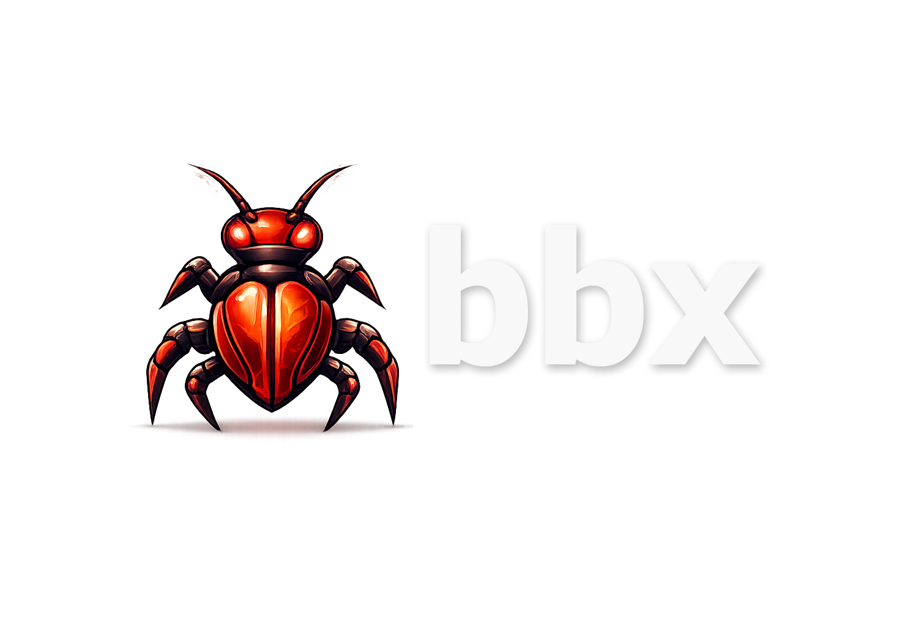

# bbx toolkit

[](https://github.com/tperich/bbx/actions/workflows/ci.yml)
[](https://github.com/tperich/bbx/actions/workflows/security-audit.yml)
[](https://github.com/tperich/bbx/actions/workflows/release.yml)

A SQLite-backed CLI for organizing bug bounty artifacts.

This toolkit imports existing outputs from recon, crawling, and HTTP capture tools, stores them in SQLite, ranks interesting rows, supports tagging, and can export correlation graphs.

See `USAGE.md` for the command guide.


New in this build:
- filtering flags: `--tag`, `--host`, `--min-score`, `--tool` on `top`, `interesting-urls`, `export`, and `graph`.

## New text filters
- `--contains`
- `--path-prefix`
- `--status`


## Presets

Save reusable filter sets and apply them later:

```bash
python3 bbx.py preset-save acme authz --tag authz --min-score 20 --path-prefix /api/
python3 bbx.py preset-list acme
python3 bbx.py top acme --preset authz
python3 bbx.py interesting-urls acme --preset authz --format csv
```


## Lab-only scan framework

This bundle now includes a queue-driven scan layer for personal labs and explicitly allowlisted assets.

Key commands:

```bash
python3 bbx.py scan-register-url acme http://127.0.0.1:8000/api/health
python3 bbx.py scan-plan acme --profile safe-recon --from-table web_targets --limit 10
python3 bbx.py scan-run acme --limit 10
python3 bbx.py scan-results acme --format json
python3 bbx.py scan-findings acme --format json
```

Guardrails:
- active checks only run against hosts in `config/allowlist.txt`
- scan profiles live in `config/scan_profiles.yaml`
- checks are intentionally lightweight: `http_probe`, `openapi_fetch`, `method_diff`, `reflection_check`


## Layout note

`bbx.py` is now a tiny entrypoint. The CLI logic lives in `bbx/cli.py`, path helpers in `bbx/paths.py`, output helpers in `bbx/output.py`, and scoring logic in `bbx/scoring.py`.


## Modular layout

The CLI is now split into command modules under `bbx/commands/`:
- `workspace.py`
- `imports.py`
- `analysis.py`
- `findings.py`
- `tags.py`
- `exports.py`
- `presets.py`
- `scan.py`

Shared command implementation remains in `bbx/core.py`, while `bbx/cli.py` is now a small parser/dispatcher entrypoint.


## New reliability commands

- `bbx doctor <workspace>` checks workspace layout, DB presence, allowlist, scan profiles, and presets.
- `bbx validate-import <kind> <file>` validates supported import file shapes before ingest.
- CLI output formats now consistently use `text`, `json`, or `csv`.
